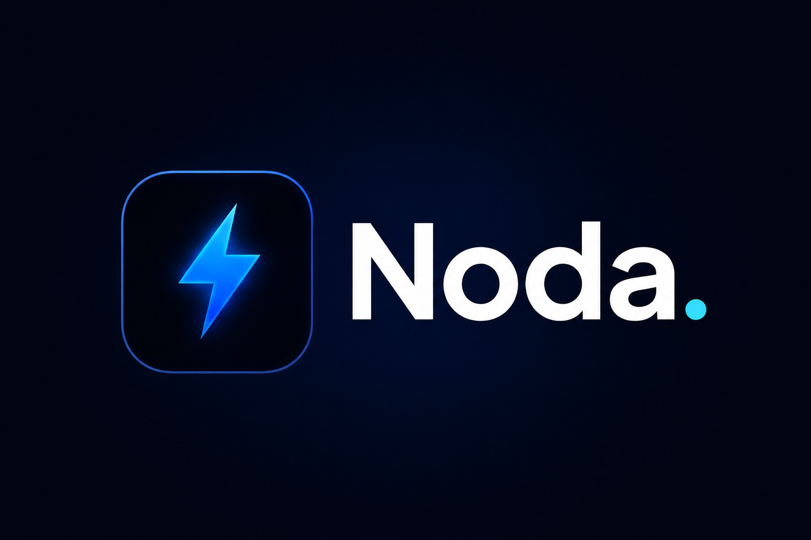

<div align="center">
  

  # NodaSolutions

  **Modern Web Application built with React, Vite, and Tailwind CSS.**

  [](https://reactjs.org/)
  [](https://vitejs.dev/)
  [](https://tailwindcss.com/)

</div>

<br />

## 🌟 Sobre o Projeto

NodaSolutions é uma aplicação web moderna, focada em performance, usabilidade e design sofisticado. O projeto utiliza as mais recentes tecnologias de front-end para entregar uma experiência de usuário excepcional, com animações fluidas e interface responsiva.

## 🚀 Tecnologias Utilizadas

Este projeto foi construído com as seguintes tecnologias:

- **[React 19](https://react.dev/)**: Biblioteca JavaScript para construção de interfaces de usuário.
- **[Vite](https://vitejs.dev/)**: Bundler e servidor de desenvolvimento ultrarrápido.
- **[Tailwind CSS](https://tailwindcss.com/)**: Framework CSS utilitário para estilização rápida e responsiva.
- **[Lucide React](https://lucide.dev/)**: Ícones elegantes e consistentes.
- **[AOS (Animate On Scroll)](https://michalsnik.github.io/aos/)**: Biblioteca para animações baseadas na rolagem da página.
- **[Oxlint](https://oxc.rs/docs/guide/usage/linter.html)**: Linter de alta performance focado em ecossistema JavaScript/TypeScript.

## 🛠️ Como Executar o Projeto

### Pré-requisitos

Certifique-se de ter o **Node.js** e o **npm** (ou **yarn**/**pnpm**) instalados na sua máquina.

### Passos para instalação e execução local

1. **Clone o repositório:**
   ```bash
   git clone <url-do-repositorio>
   cd NodaSolutions
   ```

2. **Instale as dependências:**
   ```bash
   npm install
   ```

3. **Inicie o servidor de desenvolvimento:**
   ```bash
   npm run dev
   ```

4. **Acesse a aplicação:**
   Abra seu navegador e acesse `http://localhost:5173`.

## 📦 Scripts Disponíveis

No diretório do projeto, você pode rodar os seguintes comandos:

- `npm run dev`: Inicia o servidor de desenvolvimento.
- `npm run build`: Compila a aplicação para produção (gera a pasta `dist`).
- `npm run lint`: Executa a verificação de código com o Oxlint.
- `npm run preview`: Inicia um servidor local para visualizar a build de produção.

## 🎨 Estrutura do Projeto

A estrutura de diretórios foi pensada para facilitar a manutenção e escalabilidade:

```text
NodaSolutions/
├── public/              # Arquivos estáticos globais (favicon, etc)
├── src/                 # Código-fonte principal
│   ├── assets/          # Imagens, logos e fontes
│   ├── components/      # Componentes React reutilizáveis
│   └── ...              # Demais arquivos da aplicação
├── package.json         # Configurações e dependências do projeto
├── vite.config.js       # Configuração do Vite
└── README.md            # Documentação do projeto
```


